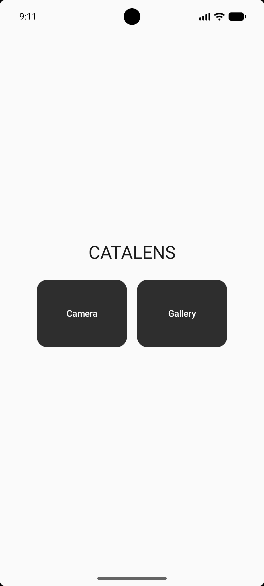
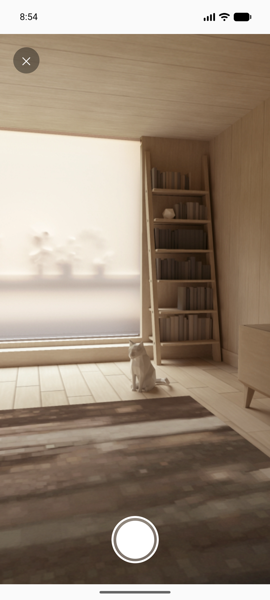
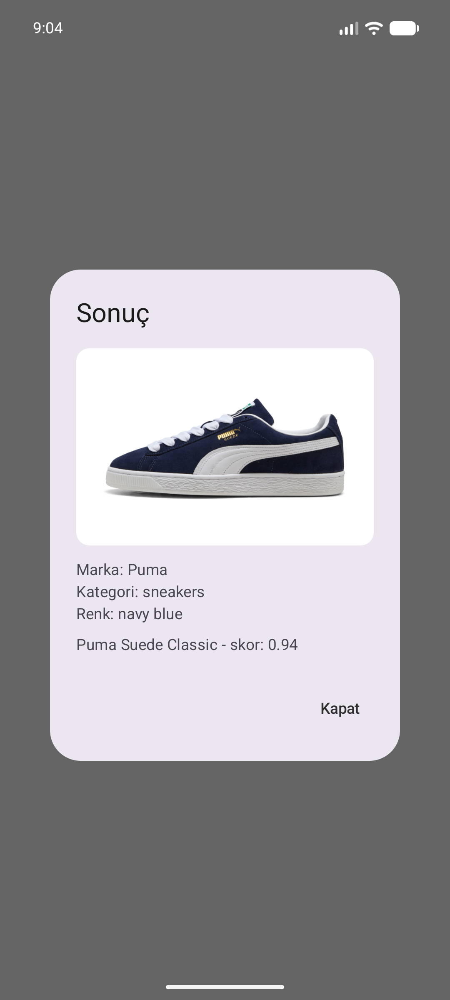

# Catalens

Catalens is a visual product recognition system. A user takes (or uploads) a photo of a product, and the system matches it against a live catalog using AI-generated descriptions and vector similarity search — returning ranked matches with a confidence score, or an honest "no match" when nothing is close enough.

This project was built as a hands-on learning exercise covering an end-to-end AI + database pipeline: image understanding, text embeddings, vector search, and a mobile client.

## How it works

```
Photo (camera or gallery)
      │
      ▼
Gemini Vision  ──►  structured JSON descriptor (brand, category, colour, form, attributes)
      │
      ▼
Deterministic text builder  ──►  embedding text
      │
      ▼
Gemini Embeddings  ──►  768-dim vector (L2-normalized)
      │
      ▼
MongoDB Atlas Vector Search  ──►  candidate matches (cosine similarity, category pre-filter)
      │
      ▼
Confidence threshold  ──►  ranked matches OR "no match"
```

## Optional modules

Beyond the core single-product pipeline above, the backend also implements:

- **Hybrid Match** — blends MongoDB Atlas Search full-text relevance with vector similarity to re-rank candidates, so exact brand/name mentions in the descriptor help break ties between visually similar products.
- **Visual Substitutes** — when the top confident match is out of stock, the server re-runs vector search filtered to the same category and `inStock: true` to suggest in-stock alternatives.
- **Multi-Shelf Recognition** — a separate `POST /recognize-multi` endpoint detects and describes every distinct product in a single photo (each with a normalized bounding box), then runs the full recognition pipeline per item. The mobile app always uses this endpoint; a photo with one product just returns a one-item result, and a photo with several shows a swipeable result per product, cropped to that product's region of the source photo. Results are capped at the 5 largest detected items.

## Screenshots

| Home | Camera | Result |
|---|---|---|
|  |  |  |

## Tech stack

| Layer | Technology |
|---|---|
| Backend API | Go (`net/http`, no framework) |
| Database | MongoDB Atlas — heterogeneous product catalog + Vector Search index |
| AI | Google Gemini API — Vision (structured output) + text embeddings |
| Mobile | Android, Kotlin, Jetpack Compose, CameraX |
| Networking (mobile) | OkHttp + kotlinx.serialization |

## Project structure

```
catalens/
├── backend/
│   ├── cmd/
│   │   ├── seed/       # ingest script: embeds products.json into MongoDB
│   │   └── server/     # HTTP server exposing POST /recognize and /recognize-multi
│   ├── internal/
│   │   ├── catalog/    # product model, embedding logic, vision schema, vector/hybrid search, substitutes
│   │   └── config/     # .env loader
│   └── data/
│       └── products.json
└── mobile/
    └── app/            # Jetpack Compose app (camera + gallery capture, swipeable results UI)
```

## Why this stack

- **MongoDB** was chosen because the product catalog is heterogeneous by design — a sneaker and a box of tea have completely different attributes, yet both need to live in the same searchable collection alongside a vector index. Atlas Vector Search lets a single aggregation pipeline combine metadata pre-filtering (e.g. `category`) with vector similarity, no joins required.
- **Gemini** provides both the vision model (photo → structured JSON, constrained by a strict response schema) and the embedding model, so the whole pipeline uses one provider end-to-end.
- Product photos are converted to **text first**, then embedded — this keeps the pipeline debuggable and explainable (you can always inspect the exact text that produced a given vector) at the cost of requiring the ingest-time and query-time text generation to stay consistent.

## API

### `POST /recognize`

Multipart form request with an `image` field.

```bash
curl -X POST -F "image=@photo.jpg" http://localhost:8080/recognize
```

Response:

```json
{
  "descriptor": {
    "brand": "Nike",
    "category": "sneakers",
    "colour": "black/red/white",
    "form": "low-top",
    "visibleText": "AIR JORDAN",
    "attributes": [{ "key": "material", "value": "leather" }]
  },
  "filterApplied": "sneakers",
  "matches": [
    { "id": "...", "name": "Air Jordan 1 Low", "brand": "Nike", "score": 0.95 }
  ],
  "noMatch": false
}
```

If no candidate clears the confidence threshold, `matches` is an empty array and `noMatch` is `true`.

### `POST /recognize-multi`

Multipart form request with an `image` field, for photos containing more than one product (e.g. a shelf). Runs Vision once to detect and describe every distinct product, then runs the same recognition pipeline per item.

```bash
curl -X POST -F "image=@shelf.jpg" http://localhost:8080/recognize-multi
```

Response:

```json
{
  "items": [
    {
      "descriptor": {
        "brand": "Nike",
        "category": "sneakers",
        "colour": "black, white",
        "form": "running shoes",
        "visibleText": "Nike",
        "attributes": [{ "key": "closure", "value": "lace-up" }],
        "boundingBox": { "xMin": 0.04, "yMin": 0.46, "xMax": 0.46, "yMax": 0.84 }
      },
      "filterApplied": "sneakers",
      "matches": [{ "id": "...", "name": "Air Jordan 1 Low", "brand": "Nike", "score": 0.87 }],
      "noMatch": false
    }
  ]
}
```

`boundingBox` coordinates are fractions (0–1) of image width/height, top-left to bottom-right — used by the mobile client to crop each result to its own region of the source photo. Detected items are sorted by bounding box area (largest first) and capped at 5.

## Running it locally

### Backend

1. Create a MongoDB Atlas free-tier (M0) cluster with a Vector Search index named `products_vec` on the `products` collection (768 dimensions, cosine similarity, `embedding` field; filter fields: `category`, `brand`, `inStock`).
2. Get a Gemini API key from [Google AI Studio](https://aistudio.google.com/).
3. Copy `backend/.env.example` to `backend/.env` and fill in your `MONGODB_URI` and `GEMINI_API_KEY`.
4. Seed the catalog:
   ```bash
   cd backend
   go run ./cmd/seed
   ```
5. Start the API server:
   ```bash
   go run ./cmd/server
   ```
   The server listens on `:8080`.

### Mobile

1. Open `mobile/` in Android Studio.
2. Run on an emulator or device with a `CAMERA` permission grant.
3. When testing on an emulator against a locally running backend, forward the port instead of relying on the emulator's default NAT gateway:
   ```bash
   adb reverse tcp:8080 tcp:8080
   ```
   and point the app at `http://127.0.0.1:8080` (already the default in `Network.kt`).

## Design notes

- **Deterministic embedding text**: product attributes are stored as a map/list and sorted before being joined into text, so the same product always produces the same embedding text regardless of map iteration order — required for the ingest script's idempotency check (a SHA-256 hash of the embedding text is stored alongside each product; unchanged products are skipped on re-run instead of being re-embedded).
- **Category fallback**: the vector search first runs with a category pre-filter (from the vision descriptor); if that returns zero results, it re-runs without the filter rather than silently returning nothing — a mislabeled category degrades to "search everything" instead of a false negative.
- **Confidence threshold**: match scores are not inherently self-explanatory — the threshold is tuned per catalog rather than assumed universal.
